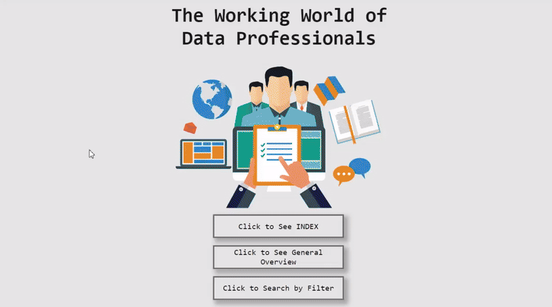
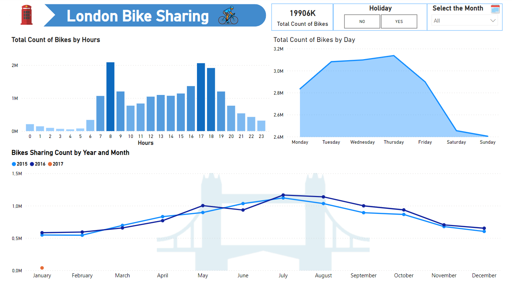
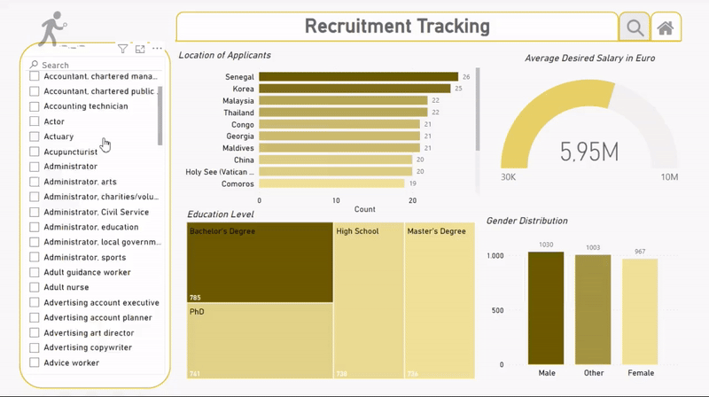

# 
  Microsoft Power BI Projects   

🚀 Welcome to my Power BI Projects Repository! 📊

I'm excited to share ongoing data explorations using Microsoft Power BI. As I learn, I'll regularly update this repository with new dashboards and analyses. Stay tuned for upcoming projects as I gather insights from diverse fields. Your feedback is precious, helping me refine and grow in this analytics journey.

## World-of-Data-Professionals
### Dashboard Highlights

1. **Annual Average Gross Salary by Experience Level in USD**

2. **Top 10 Most Sought-After Job Titles by Experience Levels**

3. **Distribution of Experience Levels Among Employees in Companies, Stratified by Workforce Size**

4. **Distribution of Remote, Hybrid, and On-site Work Environment**
   
5. **Filtered Search by Job Title, Experience Level, Year**

🔗 **[Explore Dashboard](Projects/World-of-Data-Professionals/World-of-Data-Professionals.pbix)**

## London-Bike-Sharing 🚲

Alongside PowerBI, I explored and analyzed the raw data using Python, utilizing libraries such as Pandas and Seaborn. You can review my Jupyter Notebook, where you will find a summary of the data visualizations that provide answers to questions.

### Questions:

1. **How many bikes shared annually, monthly and daily?**

2. **How many bike shared by Seasons?**

3. **What is seasonal demand per hours for bikes?**
   
4. **What is hourly bike share by day?**
   
5. **Comparison of demand for bicycles on holidays and weekends?**

6. **Biking Demand by Day of the Week (Percentage) & Seasonal Demand per Day for Bikes (Counts)**

7. **What is the correlation between weather condition and bike sharing?**

🔗 **[Explore Jupyter Notebook](Projects/London-Bike-Sharing/london-bike-sharing-analysis.ipynb)**

🔗 **[Explore Dashboard](Projects/London-Bike-Sharing/London-Bikes-Sharing.pbix)**

   

## Recruitment Tracking Dashboard 💼

Recruitment Dashboard, a powerful tool designed to streamline and enhance the recruitment process. This interactive dashboard, crafted using mock data, provides valuable insights into the demographic characteristics, education levels, experience, and salary expectations of job applicants. Additionally, it offers a user-friendly interface for effectively tracking the status of each application in the recruitment pipeline.

### Dashboard Highlights

1. **Demographic Overview**

2. **Education Insights**

3. **Experience Analysis**

4. **Salary Expectations**

5. **Process Tracking**

🔗 **[Explore Dashboard](Projects/Recruitment Tracking/Recrutiment Tracking.pbix)**

 

## Getting Started

Feel free to explore the dashboards and join me in this learning journey. Your feedback and suggestions are highly appreciated as I continue to enhance and refine these projects.

## How to Use

1. Clone the repository: `git clone https://github.com/omeryurtt/Microsoft-Power-BI.git`
2. Open the Power BI project files using Microsoft Power BI Desktop.
3. Interact with the visualizations and gain insights into the workforce data.

## Contribution

If you have suggestions or improvements, feel free to open an issue or submit a pull request. Let's learn and grow together in the world of data analytics!

Happy Analyzing! 📈✨
